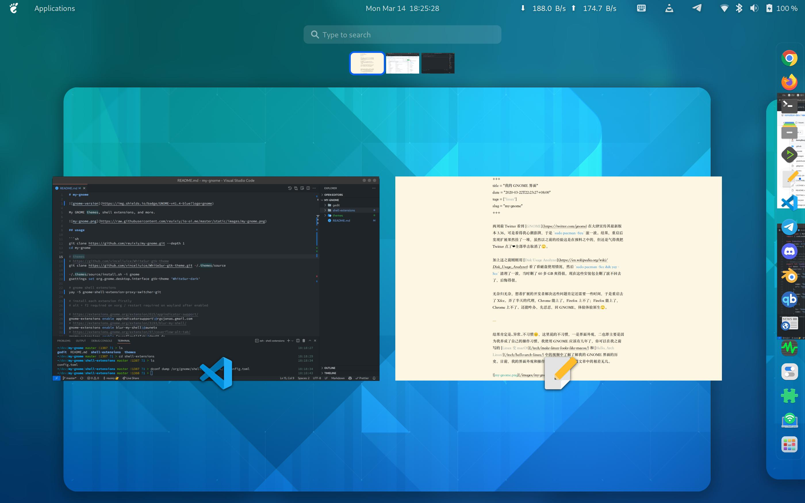

# my-gnome


My GNOME themes, shell extensions, and more.



## usage

```sh
git clone https://github.com/reuixiy/my-gnome.git --depth 1
cd my-gnome

# themes
# https://github.com/vinceliuice/WhiteSur-gtk-theme
git clone https://github.com/vinceliuice/WhiteSur-gtk-theme.git ~/.themes/source

~/.themes/source/install.sh -i gnome
gsettings set org.gnome.desktop.interface gtk-theme 'WhiteSur-dark'

# gnome shell extensions
yay -S gnome-shell-extension-proxy-switcher-git

# install each extension firstly
# alt + f2 required on xorg / restart required on wayland after enabled

# https://extensions.gnome.org/extension/615/appindicator-support/
gnome-extensions enable appindicatorsupport\@rgcjonas.gmail.com
# https://extensions.gnome.org/extension/3193/blur-my-shell/
gnome-extensions enable blur-my-shell\@aunetx
# https://extensions.gnome.org/extension/97/coverflow-alt-tab/
gnome-extensions enable CoverflowAltTab\@dmo60.de
# https://extensions.gnome.org/extension/307/dash-to-dock/
gnome-extensions enable dash-to-dock\@micxgx.gmail.com
# https://extensions.gnome.org/extension/545/hide-top-bar/
gnome-extensions enable hidetopbar\@mathieu.bidon.ca
# https://extensions.gnome.org/extension/3724/net-speed-simplified/
gnome-extensions enable netspeedsimplified\@prateekmedia.extension

dconf load /org/gnome/shell/extensions/ < shell-extensions/config.toml

# gedit
cp -r gedit/* ~/.local/share/gedit/
dconf load /org/gnome/gedit/plugins/ < gedit/plugins/config.toml

# icons
sudo pacman -S papirus-icon-theme
gsettings set org.gnome.desktop.interface icon-theme 'Papirus-Dark'
```

## acknowledgement

https://gist.github.com/balderclaassen/d12cfb70b1695c11402116d8b7f79059
