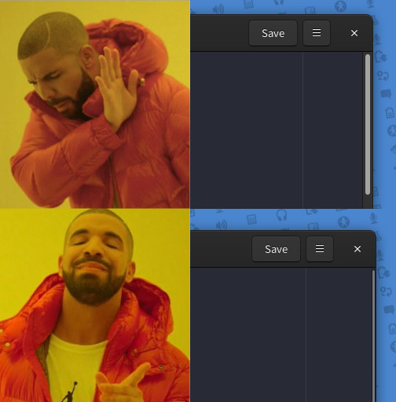

# Restore Overlay Scrolling (gedit plugin)



## Features

* Overlay scrolling was disabled in gedit 3.36
* This plugin allows you to re-enable overlay scrolling

## Installation
```bash
mkdir -p ~/.local/share/gedit/plugins/
cd ~/.local/share/gedit/plugins/
git clone https://github.com/johnfactotum/gedit-restore-overlay-scrolling.git restore-overlay-scrolling
```

## See also
* [Restore Minimap](https://github.com/johnfactotum/gedit-restore-minimap) - plugin for restoring the minimap, which was also removed in gedit 3.36
* [Restore Zen](https://github.com/johnfactotum/gedit-restore-zen) - plugin for restoring zen mode, which was also removed in gedit 3.36
* ["Minimap and overlay scrolling disappeared in 3.36"](https://gitlab.gnome.org/GNOME/gedit/issues/285) (discussion of the issue on gedit's issue tracker)
